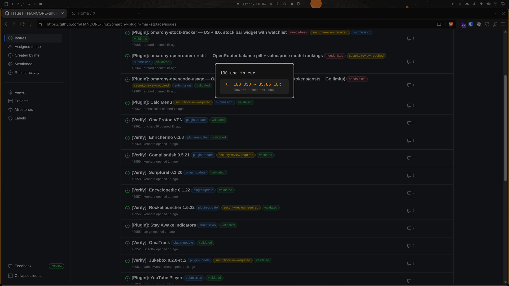

# Calc Menu

A calculator and unit/currency converter built into the Omarchy **Go** menu
(Super+Space). Type an expression or a conversion in the search box and the
result appears instantly as the top row — press **Enter** to copy it to your
clipboard.

It is a drop-in replacement for the stock `omarchy.menu`: installing and
enabling this plugin automatically routes the Go menu (and its bar button) to
Calc Menu.

## Screenshots





## Installation

```bash
omarchy plugin add https://github.com/orenaksakal/omarchy-calc-menu.git --enable --yes
```

Enabling it disables the stock `omarchy.menu` (restored automatically if you
remove Calc Menu):

```bash
omarchy plugin remove orenaksakal.calc-menu --yes
```

Requirements: an Omarchy system (Hyprland + Wayland). `wl-copy` (from
`wl-clipboard`) is used to copy results — it ships with every Wayland desktop.
No calculator packages (`qalc`, `bc`, python) are needed; everything runs in
the shell plugin itself. Live currency rates additionally use `curl`, which is
present on any Arch base install.

## Usage

### Calculations

| You type            | Result   |
|---------------------|----------|
| `2 + 5`             | 7        |
| `(2+3)*4`           | 20       |
| `10/4`              | 2.5      |
| `5%2`               | 1 (modulo) |
| `20%`               | 0.2 (percent) |
| `150 * 20%`         | 30       |
| `2^10`              | 1024 (exponent, right-assoc) |
| `2^3^2`             | 512      |
| `√16` or `sqrt(16)` | 4        |
| `5!`                | 120 (factorial) |
| `2*pi` or `2π`      | 6.28 |

Results are rounded to **two decimals** (trailing zeros dropped); whole numbers
display exactly. Values too small for two decimals and very large magnitudes
use compact scientific notation (e.g. `1.23e-4`).

The parser is whitelist-based — only digits, operators, `π pi √ ^ ! %` and
parentheses are accepted, so a query can never execute code.

### Unit & time conversion

`<amount> <unit> to <unit>` or `<amount> <unit> in <unit>` (the amount may
touch the unit):

| You type                 | Result |
|--------------------------|--------|
| `10 km to miles`         | 10 km → 6.21 miles |
| `5ft in cm`              | 5 ft → 152.4 cm |
| `2 hours to minutes`     | 2 hours → 120 minutes |
| `100°f to c`             | 100 °f → 37.78 c |
| `1 ha to acres`          | 1 ha → 2.47 acres |
| `60 mph to km/h`         | 60 mph → 96.56 km/h |
| `1 bar to psi`           | 1 bar → 14.5 psi |
| `1 kwh to kj`            | 1 kwh → 3600 kj |
| `1 light-year to km`     | 1 light-year → 9460730472580.8 km |
| `1 mt to kg`             | 1 mt → 1000000000 kg |
| `10 mb to kbit`          | 10 mb → 80000 kbit |

Supported categories: **length, mass, volume, data (decimal + binary KiB/MiB),
time, speed, area, energy, power, pressure, force, frequency, voltage,
current, resistance, angle, temperature** (C/F/K formulas). Month/year use
calendar approximations (30 d / 365 d).

### Currency conversion

ISO codes, common abbreviations, and currency symbols are all accepted:

| You type      | Result |
|---------------|--------|
| `100 usd to eur` | 100 USD → 85.83 EUR |
| `100$ to €`   | 100 $ → 85.83 € |
| `£100 to ¥`   | 100 £ → 18860.76 ¥ |
| `50 eur in usd` | 50 EUR → 58.26 USD |

Rates are fetched **once per day** (see below) and cached on disk, so currency
works offline between refreshes. Rows built on the built-in fallback table are
labelled `Approx rate`.

## Exchange rates: your own API key

By default the plugin uses the keyless `open.er-api.com` endpoint. If you
prefer your own provider, add an **exchangerate-api.com** key (free tier:
**1,500 requests/month**):

Create (or edit) the config file:

```bash
mkdir -p ~/.local/state/omarchy/settings
cat > ~/.local/state/omarchy/settings/orenaksakal.calc-menu.json <<'EOF'
{
  "apiKey": "your-key-here"
}
EOF
```

The file is watched live — no shell restart needed. When a key is present the
plugin calls `https://v6.exchangerate-api.com/v6/<key>/latest/USD`; otherwise
it falls back to the keyless endpoint. Remove or empty `apiKey` to go back to
the default.

### Rate limit: one request per day

To guarantee the free tiers are never exceeded, exchange rates are fetched
**at most once every 24 hours** — that is **≤ 31 requests per month**, far
under any 1,500/month cap. The fetch timestamp and the returned rates are
persisted to `~/.local/state/omarchy/settings/orenaksakal.calc-menu.fx.json`,
so the once-a-day budget holds across shell restarts too. A failed fetch is
also remembered for the day; the built-in approximate table keeps currency
working until the next attempt. If you change your API key, clear the cached
state to refresh sooner:

```bash
rm ~/.local/state/omarchy/settings/orenaksakal.calc-menu.fx.json
```

## Development

```bash
omarchy plugin validate .       # manifest + structure checks
git clone https://github.com/orenaksakal/omarchy-calc-menu.git
# edit Menu.qml; the shell needs a restart to pick up plugin code changes:
omarchy restart shell
```

## Security

- Calculations are whitelist-based: only digits, operators, `π pi √ ^ ! %` and
  parentheses ever reach the parser — no `eval`/`Function`, so a query cannot
  execute code.
- The API-key config and persisted-rate files are read through a bounded,
  no-follow helper that refuses symlinks, requires a regular file owned by the
  current user, and caps bytes at 8 KB. The API key is limited to 64
  alphanumeric characters before it is embedded in a curl URL.
- Live rate responses are capped at 64 KB (`curl --max-filesize` plus a buffer
  ceiling) and only bounded currency-code/value pairs (≤ 200 entries, short
  codes, sane values) are kept.
- The persisted-rate state is written through a same-directory temporary file
  with `600` permissions, then atomically renamed — it never follows a
  pre-existing symlink or truncates another target.

## License

MIT — see [LICENSE](LICENSE). Built on the MIT-licensed Omarchy menu plugin.